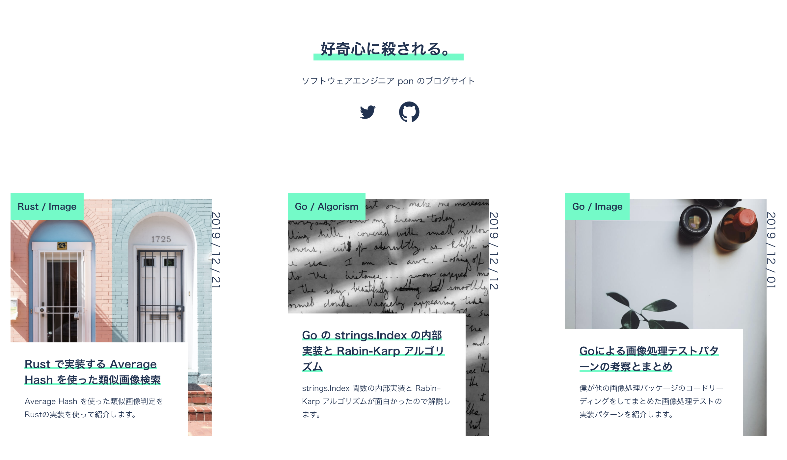

# blog-web-next

pon web site - Next.js版



## 概要

このプロジェクトは、元々Nuxt.jsで作られていたponのブログサイトをNext.jsに移行したものです。UIは元のサイトと同じに保ちながら、フレームワークをVue.js（Nuxt.js）からReact（Next.js）に変更しています。

## 機能

- ブログ記事一覧表示
- ブログ記事詳細表示
- タグによる記事フィルタリング
- ページネーション
- レスポンシブデザイン

## 技術スタック

- Next.js
- React
- Sass
- Axios
- Markdown-it
- Prism.js（コードハイライト）

## 開発環境のセットアップ

```bash
# 依存関係のインストール
npm install

# 開発サーバーの起動
npm run dev
```

## ビルドと本番環境での実行

```bash
# プロジェクトのビルド
npm run build

# 本番環境での実行
npm run start
```

## デプロイ

Vercelを使用してデプロイすることができます。

## ライセンス

このプロジェクトはponによって作成されました。
